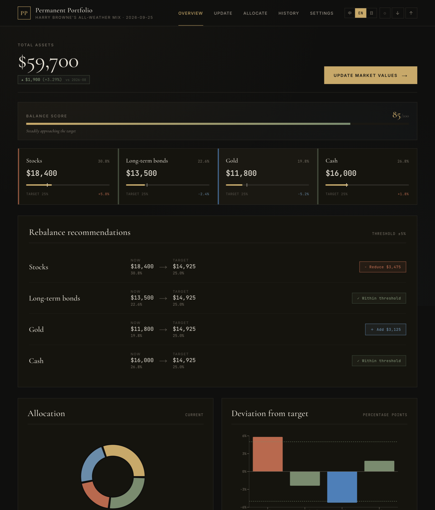
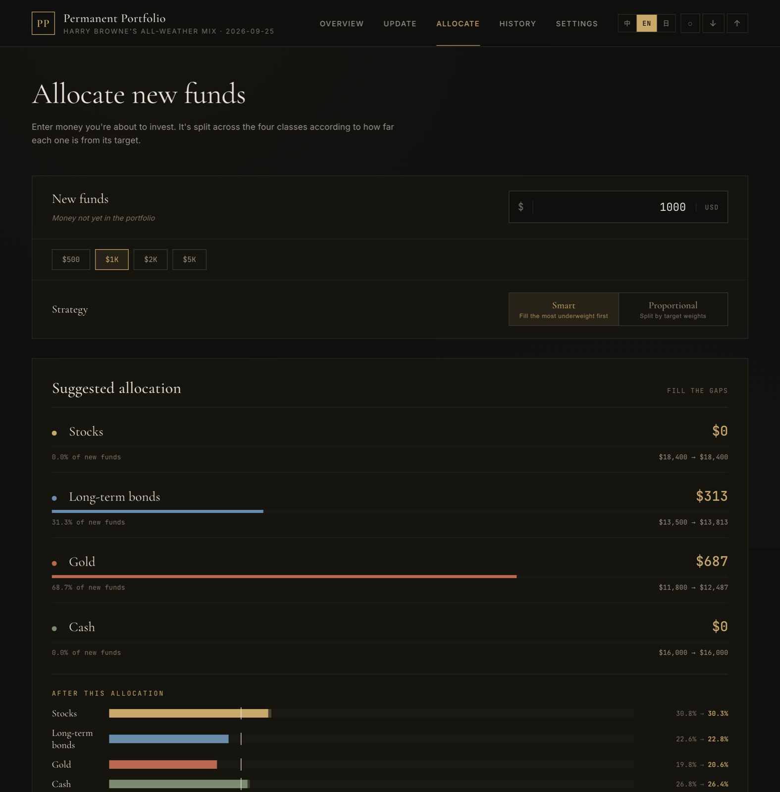
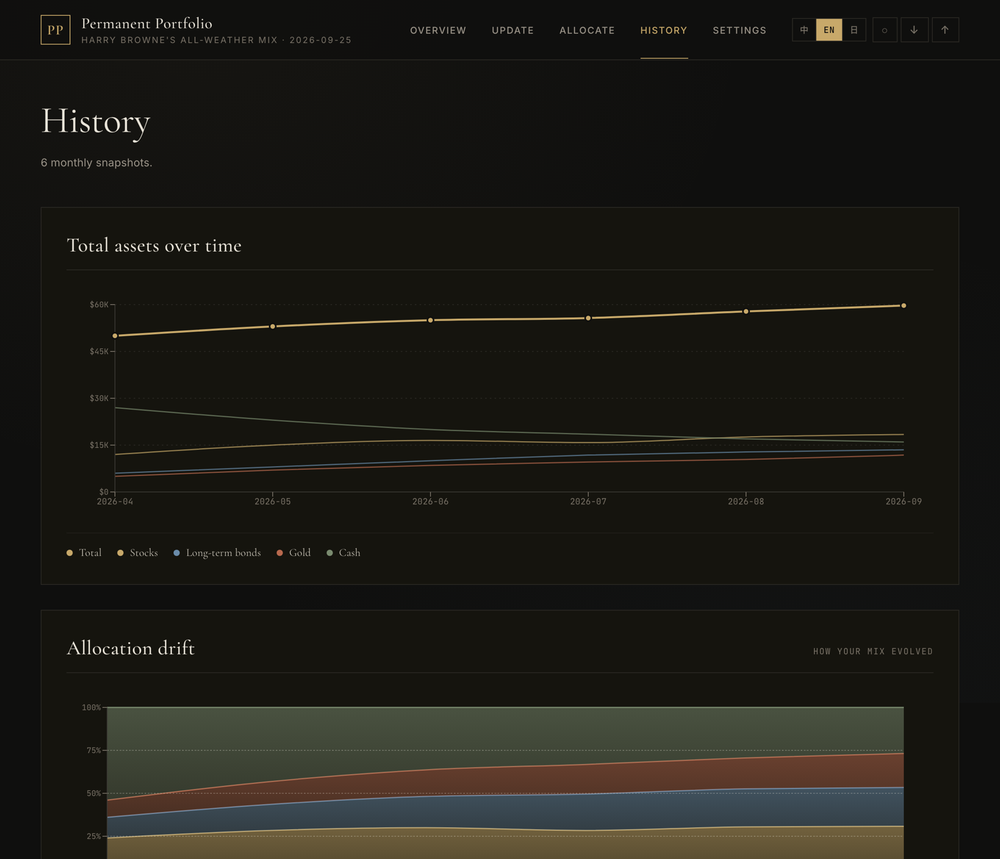
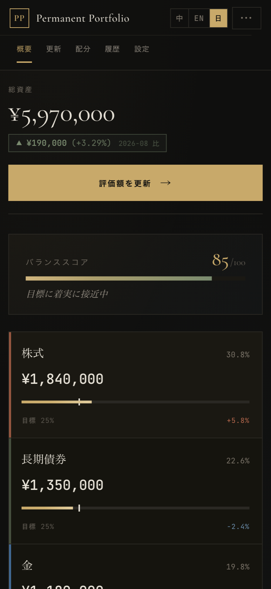

<p align="center">
  <a href="../README.md"></a>
  <a href="README.zh-CN.md"></a>
  <a href="README.ja.md"></a>
</p>

<h1 align="center">Permanent Portfolio</h1>

<p align="center">
  记录并再平衡 Harry Browne 的永久投资组合：股票、长期债券、黄金、现金。<br>
  完全在浏览器里运行，不需要注册，没有服务器，数据只在你手里。
</p>

<p align="center">
  <a href="https://shinnaaa.github.io/permanent-portfolio/"><b>打开应用 →</b></a>
</p>

<p align="center">
  <a href="https://github.com/Shinnaaa/permanent-portfolio/actions/workflows/ci.yml"></a>
  
  
  <a href="../LICENSE"></a>
</p>

<p align="center"></p>

---

## 策略简介

1981 年 Harry Browne 提出把资产平均分成四份：**股票**应对繁荣，**长期债券**应对通缩，**黄金**应对通胀，**现金**应对衰退。无论经济处于哪个阶段，总有一类资产撑住组合。唯一需要做的，是某一类偏离 25% 太多时进行再平衡。

这个应用就是帮你记这本账：填入每一类的市值，它会告诉你偏离了多少、该买入或减持多少，以及新资金该怎么分。

## 功能

- **再平衡一目了然。** 每类资产的占比、目标和偏离，0–100 的平衡分；某一类超出阈值（默认 ±5%）时，直接给出"增加 / 减少多少"。
- **新资金分配。** 输入金额，优先补齐最低配的类别（也可以严格按目标比例分），自动取整，并保证合计正好等于输入的金额。
- **月度历史。** 每次保存都会记录当月快照，图表展示总资产变化和配比的演变。
- **金额栏支持计算。** 输入 `50000+3200`、`12万` 或 `1.5k` 会自动算出结果。
- **任意货币，三种语言。** 支持 12 种货币（JPY、CNY、USD、EUR、GBP 等），界面支持 English / 中文 / 日本語，首次打开时会根据浏览器自动选择。
- **目标和备注都可以改。** 可以调整 25/25/25/25 的目标比例和阈值，也可以给每一类备注持有的账户（如"NISA""某某证券"）。
- **隐私模式。** 一键模糊总览、表格和分配结果里的金额，在公共场合查看也不怕。
- **备份与同步。** 可以导出/导入 JSON，也可以通过你自己 GitHub 账号下的私密 Gist 在多台设备间同步。
- **可安装。** 可以添加到手机主屏幕，小屏幕上也有专门的布局。

<p align="center">
  
  
</p>
<p align="center"></p>

## 你的数据

没有后端。所有数据保存在浏览器的 `localStorage` 里，不会离开你的设备。唯一的例外是开启 **Gist 同步**：应用会把数据写到你自己 GitHub 账号下的*私密* Gist，使用的 fine-grained token 只保存在你的浏览器里，只会发送给 `api.github.com`。断开同步时 token 会被删除。

备份文件的格式如下，也可以用其他工具读取或生成：

```json
{
  "version": 3,
  "holdings": { "stocks": 184000, "bonds": 135000, "gold": 118000, "cash": 160000, "updatedAt": "2026-09-25T…" },
  "settings": { "currency": "JPY", "targetStocks": 0.25, "targetBonds": 0.25, "targetGold": 0.25, "targetCash": 0.25,
                "threshold": 0.05, "notes": { "stocks": "NISA", "bonds": "", "gold": "", "cash": "" } },
  "snapshots": [{ "ym": "2026-09", "date": "2026-09-25", "stocks": 184000, "bonds": 135000, "gold": 118000, "cash": 160000 }]
}
```

金额都是 `settings.currency` 货币下的数字，不做汇率换算。

---

## 开发

```bash
npm install
npm run dev       # 开发服务器（热更新）
npm test          # 单元测试（Vitest）
npm run lint      # oxlint
npm run build     # 生产构建，输出到 dist/
```

### 部署自己的副本

Fork 本仓库，在 **Settings → Pages** 里把来源设为 **GitHub Actions**。之后每次推送到 `main`，都会依次运行 lint、测试和构建，然后自动部署。如果改了仓库名，记得把 [`vite.config.js`](../vite.config.js) 里的 `base` 改成 `/<新名字>/`。

### 目录结构

```
src/
  App.jsx            状态、持久化、Gist 同步、顶栏和标签页切换
  locale.js          提供给所有组件的语言和货币上下文
  components/        Dashboard、Onboarding、UpdateForm、AllocateFunds、History、Settings 等
  lib/               纯逻辑，不依赖 React：
    compute.js         占比、偏离、操作建议、平衡分、环比变化
    allocate.js        新资金分配（smart / proportional）
    currency.js        金额格式化，以及按货币缩放的快捷金额
    format.js          金额栏的表达式解析、日期、百分比
    storage.js         localStorage 和数据迁移（normalizeData）
    i18n.js            英文 / 中文 / 日文文案
    sample.js          试用用的示例数据
    gistSync.js        GitHub Gist API
tests/               覆盖 lib/ 全部模块的 Vitest 测试
```

`src/lib` 里的逻辑不依赖任何框架，并且都有测试覆盖；组件只负责渲染计算结果。

## 许可证

[MIT](../LICENSE)
